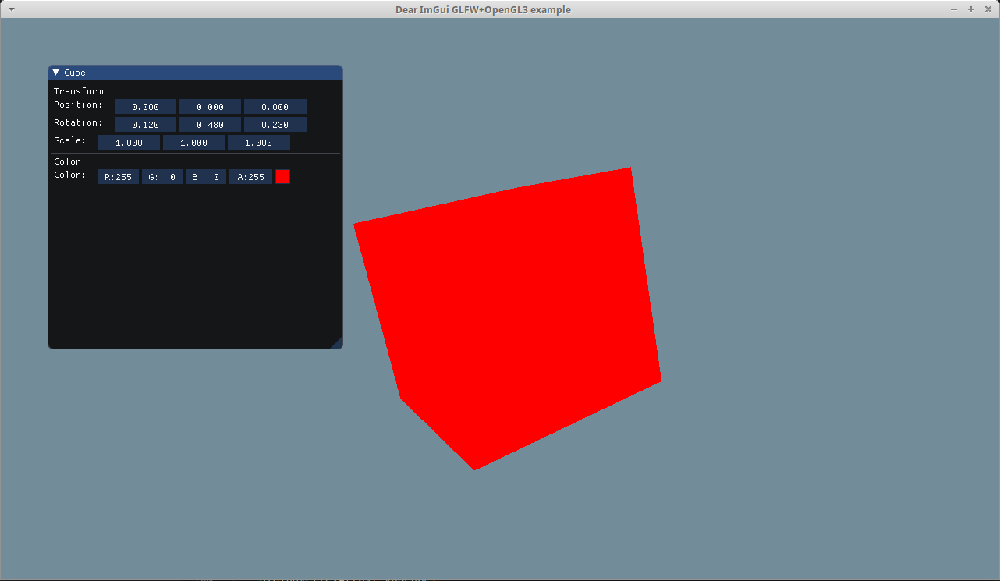

# ImGUI - Template With OpenGL - GLFW - GLAD - GLM
<p>
    <a href="https://travis-ci.org/TheSpyGeek/ImGUITemplate" alt="Build Status">
    </a>
    <a alt="ImGui Version">
    </a>
</p>

#### Description

This is a template for a OpenGL project with [ImGui](https://github.com/ocornut/imgui) using GLFW, GLAD, GLM librairies.




#### How to clone

```git clone --recursive https://github.com/TheSpyGeek/ImGUITemplate.git```


# Compile

### On Linux

##### Dependencies

To install dependices :

```sudo apt-get install -y build-essential cmake xorg-dev libgl1-mesa-dev libfreetype6-dev```

To compile : 

* create build directory in the project's directory :  ```mkdir build```
* In this directory run : ```cmake ..```

* Compile with make : ```make```

### On Windows

##### Dependencies

* [Cmake](https://cmake.org/download/)
* [Mingw](https://sourceforge.net/projects/mingw-w64/)

To compile : 

* create ```build``` directory in the project's directory
* Run ```Cmake-gui``` and configure the build using the ```Mingw Makefiles``` option
* Run ```mingw-w64``` or ```mingw-w32``` 
* Go to project's directory then ```build``` directory
* Run ```mingw32-make```


### Run

Type ```./imgui-template``` to run the program